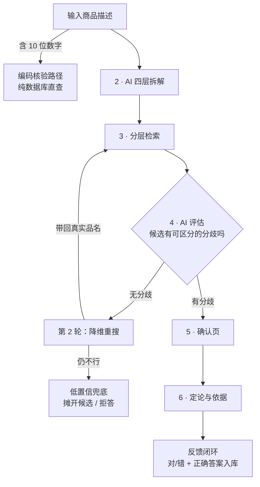
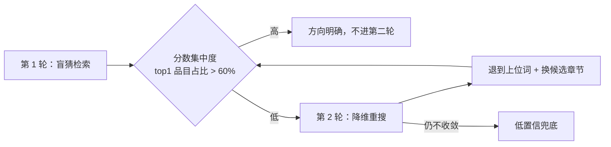
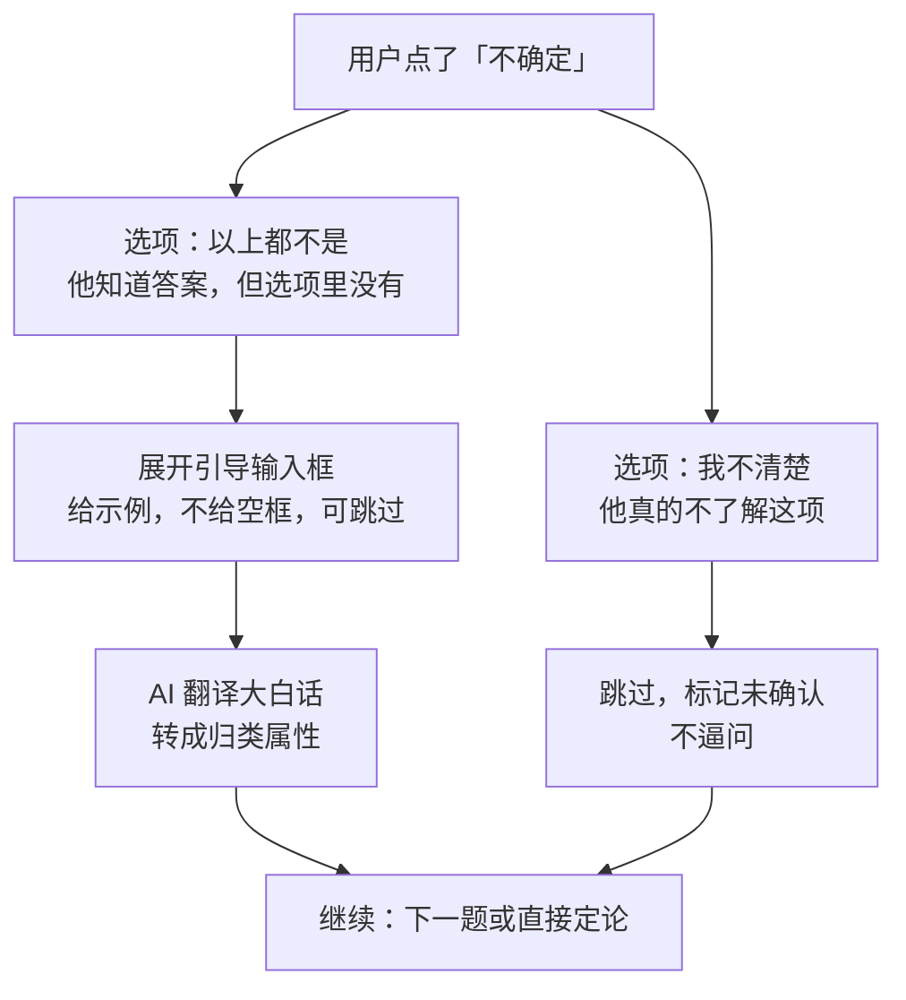

# HS Copilot · 归类链路重构设计

> 版本 v1.0 ｜ 2026-09-02 ｜ 状态：**待评审，未动代码**
> 对应代码：`D:\hs-copilot-web\server.js` / `app.js`

---

## 0. 一句话背景

MVP 的工程搭建已完成，但**归类准确性从未被验证**。项目文档 `01-项目进度.md` 记录的 5 个"✅ 通过"用例，实测标准为"页面能渲染"，不是"归类正确"。本文给出链路重构的完整设计。

---

## 1. 实测发现的问题

### 1.1 P0 致命（直接导致答案错误）

| # | 问题 | 位置 | 实测证据 |
|---|---|---|---|
| 1 | 切词命中即停止 | `server.js:141-151` | "不锈钢真空保温杯"→"不锈钢"先命中即 break，"保温""杯"不再计分 |
| 2 | AI 查询扩展从未被调用 | `server.js:371` | 触发条件 `distinctHeadings < 3`，保温杯案例检索出 4 个品目，**不触发**，AI 扩展一次未执行 |
| 3 | 品目名额只取前 4 个家族 | `server.js:185` | 正确答案 9617 排第 5 家族，直接出局 |
| 4 | 首页搜索整串精确匹配 | `server.js:84` | "不锈钢保温杯" → `{"results":[]}` |

### 1.2 P1 重要（损害可信度）

| # | 问题 | 位置 | 说明 |
|---|---|---|---|
| 5 | AI 编造编码与话术 | `P2_SYSTEM:227` | 自称"正确税号应为 7323.93.00"（错，真实为 9617 系列），并编造"可能涉及进口许可证" |
| 6 | 确认问题不从候选分歧产生 | `P1_SYSTEM:217` | 未要求 AI 对比候选差异，问的问题与候选无关 |
| 7 | 税则用语与口语脱节 | 数据层 | 全库"保温杯" 0 条，CIQ 俗名表 0 条。税则称"保温瓶"（9617.00.10 / 9617.00.90） |

### 1.3 P2 缺失（限制长期改进）

| # | 问题 |
|---|---|
| 8 | 无反馈闭环，每跑一个商品系统经验归零 |
| 9 | 无准确率基准，无法衡量改进效果 |

### 1.4 实测数据（三个翻车案例）

| 输入 | 正确答案 | 当前候选中的排位 | 结论 |
|---|---|---|---|
| 不锈钢真空保温杯 500ml | 9617.00.90 | **未进候选** | 完全失败 |
| 实木蓝牙音箱 | 8518.22 | 第 13 位 | 被 8418 冷藏箱淹没 |
| 电动牙刷 | 8509803000 | 第 13 位 | 被 8443 印刷机淹没 |

---

## 2. 目标与验收标准

| 指标 | 当前 | 目标 |
|---|---|---|
| 候选集命中率（正确答案进前 16） | 约 1/3 | **> 70%** |
| P1 首响延迟 | 4.7s | 常规 < 5s，触发第二轮 < 10s |
| 拒答率 | 0%（在硬答） | **5~15%** |
| 三个翻车案例 | 见上表 | 全部进入前 3 位 |

---

## 3. 完整流程



**与现流程的三点本质差异：**

1. **AI 从"下游消费者"变为"上游规划者"** —— 现行是检索完才交给 AI，改后是 AI 先规划再检索
2. **从"一次定生死"变为"可自我修正"** —— 两轮循环，第二轮带第一轮的真实品名（grounding）
3. **从"必须给答案"变为"可以不确定"** —— 新增兜底出口，拒答是特性不是失败

---

## 4. 分层检索设计

### 4.1 四层拆解的权重分配

| 层级 | 示例 | 检索权重 | 用途 |
|---|---|---|---|
| 核心商品 | 保温杯 | 最高 | 主检索词，决定章和品目 |
| 关键结构 | 真空 | 次高 | 在品目内区分子目 |
| 材质属性 | 不锈钢 | 低 | **只在已定品目内过滤，不跨章检索** |
| 普通参数 | 500ml | 不参与 | 仅 `affectsCode=true` 时参与 |

> **为什么这样分层**：海关归类的判断顺序本身就是分层的——先定"是什么东西"（品名/种类，决定章和品目），再看"什么结构功能"（决定子目），最后看"什么材质规格"（决定本国 10 位码）。四层拆解与之同构。

### 4.2 检索执行顺序

```
1. core.word + core.alt   → 全库主检索，最高权重
2. core.chapters          → 指定章节内兜底检索
3. structure.word         → 辅助检索，中权重
4. material.word          → 仅在已定品目内过滤
5. params (affectsCode)   → 仅标记为真时参与
→ 合并去重打分 → 候选集（≤16 条）
```

**注意**：原始 query 路、扩展词路必须**分别检索再合并**，不能混在一次调用里（`retrieveCandidates(query, extraKws)` 会让扩展词被切词缺陷吞掉）。

### 4.3 两轮循环

> **状态更新（2026-09-02）：本节设计已移除，未保留在代码中。**
> 消融实验（`node tools/ablation.cjs`）显示：第二轮累计触发 3 次、0 次改变候选排名。
> 根因是 §4.1 的 `core.alt`（让 AI 直接给税则同义说法：保温杯 → 保温瓶）已在同一轮内完成降维，
> 第二轮的活被首轮吸收了。恢复条件见 `server.js` 中 `candidatesFor` 上方注释。
> 下文保留仅作设计留档。



| 要点 | 说明 |
|---|---|
| 触发信号 | **分数集中度**（纯数值计算，不问 AI）。top1 品目占比高 = 方向明确；分散在 4 个品目各 25% = 瞎蒙 |
| 第二轮策略 | **降维，不是重复**。实测："保温杯"0 条 → "保温"6 条（含 9617）→ "容器"大量命中。上位概念在库里必然存在 |
| 防锚定 | 第二轮必须显式指令"忽略第一轮的失败结果，从更上位概念重新开始" |
| 上限 | 2 轮。第三轮边际收益低于延迟代价 |

---

## 5. 自适应提问设计

### 5.1 现状

`P1_SYSTEM`（server.js:217）写死"生成 1-2 个确认问题"，单轮，不自适应。

### 5.2 三个自适应机制

| 机制 | 说明 |
|---|---|
| 按区分力排序 | 对候选的差异维度计算"该维度确定后能排除多少候选"，取前 3 个 |
| **逐题收敛检查** | 问几个问题**不预先设定**，每答一题重新评估；收敛则跳过剩余题直接定论 |
| 多轮仅由依赖触发 | 问题互不依赖 → 一次问完；**只有问题间存在条件依赖才多轮**。例：先问"整机还是零件"→ 答"零件"才需问"用于什么设备"。最多 2 轮 |

### 5.3 停止条件（任一触发即停）

1. 候选已收敛（只剩一个 10 位编码）
2. 达到 3 问上限
3. 用户连续两次选"不确定"

> **为什么有上限**：问不出来往往不是问题不够，而是候选不对。此时应回检索循环换候选，不是继续加问。

### 5.4 零延迟实现（关键优化）

**让 AI 生成问题时，为每个选项附带对应的候选编码子集**：

```json
{
  "attr": "内胆材质",
  "question": "这个保温杯的内胆材质是？",
  "options": [
    {"label": "玻璃内胆", "codes": ["9617001100"]},
    {"label": "其他材质", "codes": ["9617001900"]},
    {"label": "以上都不是（我补充说明）", "codes": []},
    {"label": "我不清楚这项", "codes": []}
  ]
}
```

用户选"玻璃内胆" → 前端筛掉 9617001900 → 候选剩 1 条 → **纯前端判断收敛，无需再调 AI**。

仅在"答完后仍未收敛且剩余问题都不适用"时，才调 AI 生成新一轮问题。

### 5.5 其他要点

- **0 问是最优路径**：候选已收敛时 `questions` 必须为 `[]`，直接给结论。不要为提问而提问
- **"不确定"是退出信号**：该维度作废、不参与收敛判断；连续两次即停止提问，转低置信路径

---

## 6. 「不确定」双路径



| 要点 | 说明 |
|---|---|
| 拆选项 | 现行"不确定"混合了两种用户状态，必须拆开 |
| 给引导不给空框 | 例：`placeholder` 写"例如：里面是亮闪闪的金属，磁铁吸不住"，AI 再翻译成"非磁性金属，可能为 304 不锈钢或铝" |
| AI 收到后做三件事 | ①映射到已有选项 ②判断是否冒出新关键属性（触发重检索）③确实无法确定则作废 |
| **安全钳制** | **用户输入只能作为属性描述参与检索，不能直接变成编码结论**。用户可能输入"客户给的编码是 7323.93.00"，若采信则绕过"编码只来自数据库"的根本原则 |
| 可选不强制 | 选了"以上都不是"仍可直接跳过不填 |
| 数据是金矿 | 某题"不确定"率持续偏高 → 题目设计差或选项覆盖不全；补充内容 → 用于优化选项。最真实的 badcase 来源 |

---

## 7. 提示词设计

### 7.1 查询规划（新增，替代 `EXPAND_SYSTEM`）

```
你是中国海关 HS 归类助手。用户给出一个商品描述（可能是口语化大白话）。
任务：把描述拆解成四层，用于指导税则数据库检索。

四层定义与判定规则：
1. core（核心商品）——这个东西"是什么"，回答"它属于哪一类物品"
   - 判据：去掉所有修饰词后剩下的那个名词
   - 正例：「不锈钢真空保温杯」→核心是「保温杯」，不是「不锈钢」
   - 反例：「铝合金 iPad 触控笔」→核心是「触控笔」，铝合金和 iPad 都不是
2. structure（关键结构）——影响归类的结构/功能特征，如「真空」「折叠」「带电加热」
3. material（材质）——制成材料，如「不锈钢」「实木」「铝合金」
4. params（规格参数）——容量/尺寸/功率/型号。逐项标注 affectsCode：
   - true  = 该参数会影响编码（如冷藏箱按容积分档、电机按功率分档）
   - false = 该参数只用于申报，不影响编码（如保温杯的 500ml）

另外输出 chapters：你认为该商品可能所属的 HS 章节号（2 位），最多 3 个。
税则共 96 个章节，你给出的章节会用于库内兜底检索，宁可多给不要漏给。
同时给出 alt：税则品名中可能出现的同义说法（如「保温杯」→「保温瓶」「真空容器」）。

只输出 JSON，不要任何解释文字：
{"core":{"word":"","alt":[],"chapters":[]},"structure":{"word":""},"material":{"word":""},"params":[{"key":"","value":"","affectsCode":false}],"confidence":"high|medium|low"}
```

### 7.2 P1 提问（改造 `P1_SYSTEM`）

**关键改动：**

1. 问题**必须**从候选编码之间的差异中产生，说明该问题区分了哪几个候选
2. 每个选项附带 `codes` 字段（该选项对应的候选编码子集），供前端做零延迟收敛判断
3. 明确 `questions` 为空的条件：**候选已收敛时必须为 `[]`**
4. "不确定"拆为 `以上都不是（我补充说明）` 与 `我不清楚这项`
5. 每题附 `hintPlaceholder`，给输入框示例而非空框

**输出结构：**

```json
{
  "productName": "",
  "knownAttrs": [{"key": "", "value": ""}],
  "questions": [
    {
      "attr": "内胆材质",
      "question": "这个保温杯的内胆材质是？",
      "hintPlaceholder": "例如：里面是亮闪闪的金属，磁铁吸不住",
      "options": [
        {"label": "玻璃内胆", "codes": ["9617001100"]},
        {"label": "其他材质", "codes": ["9617001900"]},
        {"label": "以上都不是（我补充说明）", "codes": []},
        {"label": "我不清楚这项", "codes": []}
      ],
      "why": "候选 9617001100 与 9617001900 的差异仅在内胆材质",
      "whyDetail": ""
    }
  ],
  "converged": false,
  "provisionalCode": null,
  "confidence": "medium",
  "refuse": false,
  "refuseReason": ""
}
```

### 7.3 P2 定论（改造 `P2_SYSTEM`）

**关键改动：**

1. **删除**（server.js:227）："不允许因为『理想编码不在候选中』而拒答"
   - 理由：这条在逼 AI 硬答，是保温杯案例 AI 编造 7323.93.00 的诱因之一
   - 改为：候选与商品明显不符时，允许 `selectedCode = null` 且 `refuse = true`
2. 新增 `unconfirmed` 字段：列出未确认的属性，结论页必须展示
3. 保留安全钳制：编码必须命中候选，税率/名称/申报要素一律回查数据库覆盖

**输出结构新增字段：**

```json
{
  "selectedCode": "",
  "confidence": "high|medium|low",
  "reasons": [],
  "counterfactuals": [],
  "alternatives": [],
  "unconfirmed": ["内胆材质", "容量"],
  "refuse": false,
  "refuseReason": ""
}
```

---

## 8. 接口字段变更

| 接口 | 变更 |
|---|---|
| `POST /api/classify` | 入参不变；内部改为并行发起「四层拆解」与「原始词面检索」，合并检索 |
| `POST /api/classify` 返回 | 新增 `converged`（是否已收敛）、`questions[].options[].codes`、`questions[].hintPlaceholder` |
| `POST /api/decide` 返回 | 新增 `unconfirmed` |
| `GET /api/search` | 改为复用 `retrieveCandidates`，不再使用整串 FTS 短语匹配 |

---

## 9. 改动清单

### 第一批（约 30 行，收益最大）

| 文件 | 位置 | 改动 |
|---|---|---|
| server.js | L192-208 | 用 §7.1 提示词替换 `EXPAND_SYSTEM`，`llmExpand` 改为返回四层结构 |
| server.js | L367-376 | `candidatesFor` 删掉 `if (distinctHeadings < 3)`，改为四层规划与原始检索并行 |
| server.js | L119-190 | 新增按四层权重合并检索结果的逻辑 |

### 第二批（检索缺陷修复）

| 文件 | 位置 | 改动 |
|---|---|---|
| server.js | L141-151 | 去掉命中即 `break`，改为同长度去重、跨长度累加 |
| server.js | L185 | 品目分组从 4 组放宽到 6 组，且为中心词命中品目保留至少 1 个名额 |
| server.js | L83-87 | `apiSearch` 改为复用 `retrieveCandidates` |

### 第三批（循环）

| 文件 | 位置 | 改动 |
|---|---|---|
| server.js | L367-376 | 加分数集中度计算；未收敛时发起第二轮降维检索 |
| server.js | — | 第二轮提示词：显式要求忽略第一轮结果、降维到上位词 |

### 第四批（产品完善）

| 文件 | 位置 | 改动 |
|---|---|---|
| server.js | L213-224 | `P1_SYSTEM` 按 §7.2 改造 |
| server.js | L226-235 | `P2_SYSTEM` 按 §7.3 改造 |
| app.js | 确认页 | 收敛检查（前端筛选候选）、依赖分支请求下一轮、不确定双路径 |
| 新增 | — | 反馈记录表（SQLite），存 query / 结论 / 用户对错 / 正确答案 |

---

## 10. 验收用例

### 10.1 必过（三个已知翻车案例）

| 输入 | 期望 |
|---|---|
| 不锈钢真空保温杯 500ml | 候选含 9617.00.90，且排进前 3 |
| 实木蓝牙音箱 | 8518.22 进入前 3 |
| 电动牙刷 | 8509803000 进入前 3 |

### 10.2 回归（确保不倒退）

| 输入 | 期望 |
|---|---|
| 9405210090（编码核验） | 返回完整税率与申报要素，不受影响 |
| 铝合金 iPad 触控笔 | 仍给出 9608 项下结论 |
| 首页搜索"保温杯" | 不再返回空数组 |

### 10.3 基准集

补充 30 个真实业务商品（覆盖化工、机械、纺织、电子、日用五大类），记录改前改后的候选命中率，作为后续迭代的基线。

---

## 11. 保持不变（不要误改）

- 编码核验路径（纯数据库、不消耗 LLM）
- 安全钳制：模型输出的编码必须命中候选集；名称、税率、申报要素一律回查数据库覆盖
- 申报要素来自数据库，已确认信息自动预填
- 历史记录 localStorage

---

## 12. 暂不做

| 项 | 理由 |
|---|---|
| 图片识别 | 报关员手上有的是品名和规格书，不是商品照片，场景不成立 |
| 语义向量检索 | 过早。等基础检索修完、30 例基准命中率仍低于 70% 再考虑 |
| 多轮闲聊 | 这是工具，不是聊天机器人 |
| 部署上云 | 准确率未过关前，上云只是把错误结论给更多人看 |
